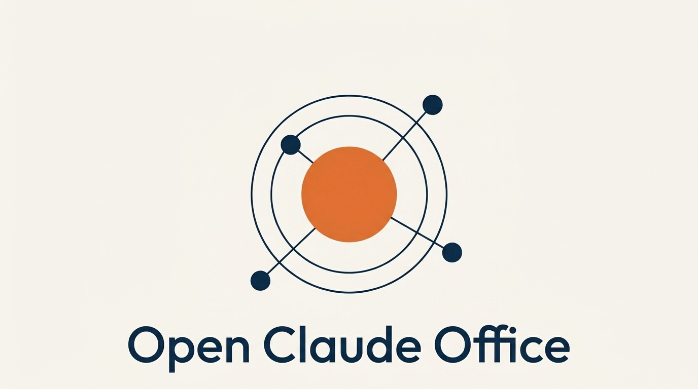

<div align="center">
  

  <h1>Open Claude Office</h1>
  <p><strong>Modular AI Agent Ecosystem — 47 Agents, 23 Skills, 8 Modules</strong></p>

  <p>
    
    
    
    
    
  </p>

  <p>
    <a href="README.en.md"><strong>English</strong></a> | <a href="README.ko.md"><strong>한국어</strong></a>
  </p>
</div>

---

## Overview

Open Claude Office is a modular AI agent ecosystem designed for Claude Code. It provides a complete `.claude/` configuration that drops into any project, delivering 47 specialized agents, 23 skills, and 15 slash commands — all orchestrated natively across Claude Code, Codex CLI, and Gemini CLI without external dependencies.

## Key Features

- **47 AI Agents** — Specialized agents for code analysis, design generation, documentation, Git workflows, quality gates, and dev lifecycle management
- **Multi-CLI Orchestration** — Claude Code leads orchestration while Codex CLI handles review/validation and Gemini CLI handles design/visual tasks
- **Drop-in Configuration** — Copy `.claude/` into any project for instant AI-powered development workflows
- **23 Skills & 15 Commands** — Comprehensive slash commands covering project scaffolding, sprint management, feature development, and deployment
- **10 Automation Hooks** — Safety checks, progress tracking, doc sync, and state machine bridges that trigger automatically

## Tech Stack

| Category | Technologies |
|----------|-------------|
| Core | Claude Code, SvelteKit |
| AI Orchestration | Codex CLI, Gemini CLI |
| Workflow | Slash Commands, Hooks, Agent MANIFEST routing |
| Templates | SvelteKit Dashboard, Astro Landing |

## Getting Started

```bash
# 1. Clone
git clone https://github.com/tygwan/open-claude-office.git

# 2. Copy .claude/ into your project
cp -r open-claude-office/.claude/ /path/to/your-project/

# 3. Open your project in Claude Code
cd /path/to/your-project && claude
```

## License

MIT
